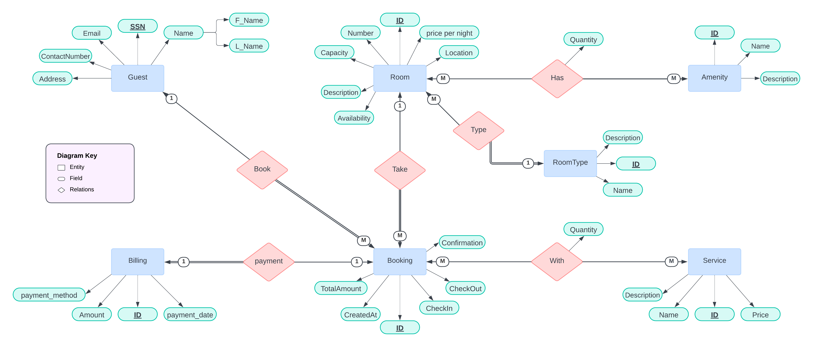

<p align="center">
    
</p>

## Project Description
Hotel Reservation System: Track room availability, bookings, guest information, billing, and services.

<br />

## Table of Contents

* [Getting Started](#getting-started)
* [ER Diagram](./ERD.png)
* [Rational Schema](rational-schema.jpg)
* [Schema](#schema)
* [Database Seed Data](#seed-data)
* [End Points](https://github.com/Y-Baker/alx-airbnb-project-documentation/blob/main/user-stories/README.md)
* [Authors](#authors-black_nib)

## Getting Started

1- Clone the repository
```bash
git clone https://github.com/Y-Baker/Hotel-Reservation.git
```

2- Configure Connection String
- Open `appsettings.json` file and update the `SQL-Server` string with your SQL Server connection string.

3- Update Database
```bash
dotnet ef database update
```

4- Run the application
```bash
dotnet run
```

5- Open the browser and navigate to the following URL
```
https://localhost:{port}
```

## ER Diagram


## Schema
```sql
-- Guest Table
CREATE TABLE Guest (
    SSN VARCHAR(20) PRIMARY KEY,
    F_Name VARCHAR(255) NOT NULL,
    L_Name VARCHAR(255) NOT NULL,
    Email VARCHAR(255) NOT NULL UNIQUE,
    ContactNumber VARCHAR(20),
    Address VARCHAR(255)
);

-- Room Type Table
CREATE TABLE RoomType (
    RoomTypeID INT PRIMARY KEY IDENTITY(1,1),
    Name VARCHAR(255) NOT NULL UNIQUE,
    Description TEXT
);

-- Room Table
CREATE TABLE Room (
    RoomID INT PRIMARY KEY IDENTITY(1,1),
    RoomNumber VARCHAR(10) UNIQUE NOT NULL,
    RoomTypeID INT NOT NULL,
    Capacity INT NOT NULL,
    PricePerNight DECIMAL(10, 2) NOT NULL,
    Availability BIT DEFAULT 1,
    Location VARCHAR(255),
    Description TEXT,
    FOREIGN KEY (RoomTypeID) REFERENCES RoomType(RoomTypeID)
);

-- Amenity Table
CREATE TABLE Amenity (
    AmenityID INT PRIMARY KEY IDENTITY(1,1),
    Name VARCHAR(50) NOT NULL UNIQUE,
    Description TEXT
);

-- Room Amenity Table
CREATE TABLE RoomAmenity (
    RoomID INT NOT NULL,
    AmenityID INT NOT NULL,
    Quantity INT DEFAULT 1,
    PRIMARY KEY (RoomID, AmenityID),
    FOREIGN KEY (RoomID) REFERENCES Room(RoomID),
    FOREIGN KEY (AmenityID) REFERENCES Amenity(AmenityID)
);

-- Booking Table
CREATE TABLE Booking (
    BookingID INT PRIMARY KEY IDENTITY(1,1),
    GuestID VARCHAR(20) NOT NULL,
    RoomID INT NOT NULL,
    CheckIn DATE NOT NULL DEFAULT GETDATE(),
    CheckOut DATE NOT NULL,
    TotalAmount DECIMAL(10, 2) NOT NULL,
    Confirmation BIT DEFAULT 0,
    CreatedAt DATETIME DEFAULT GETDATE(),
    FOREIGN KEY (GuestID) REFERENCES Guest(SSN),
    FOREIGN KEY (RoomID) REFERENCES Room(RoomID)
);

-- Service Table
CREATE TABLE Service (
    ServiceID INT PRIMARY KEY IDENTITY(1,1),
    Name VARCHAR(50) NOT NULL UNIQUE,
    Description TEXT,
    Price DECIMAL(10, 2) NOT NULL
);

-- Booking Service Table
CREATE TABLE BookingService (
    BookingID INT NOT NULL,
    ServiceID INT NOT NULL,
    Quantity INT NOT NULL DEFAULT 1,
    PRIMARY KEY (BookingID, ServiceID),
    FOREIGN KEY (BookingID) REFERENCES Booking(BookingID),
    FOREIGN KEY (ServiceID) REFERENCES Service(ServiceID)
);

-- Billing Table
CREATE TABLE Billing (
    BillingID INT PRIMARY KEY IDENTITY(1,1),
    BookingID INT NOT NULL,
    Amount DECIMAL(10, 2) NOT NULL,
    PaymentMethod VARCHAR(50) NOT NULL,
    PaymentDate DATETIME NOT NULL DEFAULT GETDATE(),
    FOREIGN KEY (BookingID) REFERENCES Booking(BookingID)
);

-- Indexes
CREATE INDEX idx_guest_email ON Guest(Email);
CREATE INDEX idx_room_number ON Room(RoomNumber);
CREATE INDEX idx_booking_room ON Booking(RoomID);
CREATE INDEX idx_booking_guest ON Booking(GuestID);
```

## Seed Data
```sql
-- Insert into Guest Table
INSERT INTO Guest (SSN, F_Name, L_Name, Email, ContactNumber, Address)
VALUES 
('1234567890', 'Yousef', 'Ali', 'yousef.ali@example.com', '1234567890', '123 Elm Street'),
('2345678901', 'Mohamed', 'Hassan', 'mohamed.hassan@example.com', '0987654321', '456 Maple Avenue'),
('3456789012', 'Ahmed', 'Saeed', 'ahmed.saeed@example.com', '1122334455', '789 Oak Drive'),
('4567890123', 'Fatima', 'Mahmoud', 'fatima.mahmoud@example.com', '1231231234', '321 Birch Lane'),
('5678901234', 'Hala', 'Ibrahim', 'hala.ibrahim@example.com', '9876543210', '654 Pine Circle'),
('6789012345', 'Omar', 'Kamal', 'omar.kamal@example.com', '5647382910', '987 Spruce Way'),
('7890123456', 'Amal', 'Nabil', 'amal.nabil@example.com', '4321567890', '654 Cedar Road'),
('8901234567', 'Nada', 'Mostafa', 'nada.mostafa@example.com', '3124567890', '159 Walnut Street'),
('9012345678', 'Hussein', 'Zaki', 'hussein.zaki@example.com', '6453728190', '753 Cherry Drive'),
('0123456789', 'Laila', 'Ahmed', 'laila.ahmed@example.com', '9876123450', '258 Ash Avenue');

-- Insert into RoomType Table
INSERT INTO RoomType (Name, Price, Description)
VALUES 
('Single', 100.00, 'A single bed room'),
('Double', 150.00, 'A room with two beds'),
('Suite', 250.00, 'A luxurious suite with additional amenities');

-- Insert into Room Table
INSERT INTO Room (RoomNumber, RoomTypeID, Capacity, PricePerNight, Availability, Location, Description)
VALUES 
('101', 1, 1, 100.00, 1, 'First Floor', 'Cozy single room'),
('102', 1, 1, 100.00, 1, 'First Floor', 'Single room with garden view'),
('201', 2, 2, 150.00, 1, 'Second Floor', 'Double room with balcony'),
('202', 2, 2, 150.00, 1, 'Second Floor', 'Double room with street view'),
('301', 3, 4, 250.00, 1, 'Third Floor', 'Luxury suite with a city view'),
('302', 3, 4, 250.00, 1, 'Third Floor', 'Suite with extra amenities'),
('401', 1, 1, 100.00, 1, 'Ground Floor', 'Economy single room'),
('402', 2, 2, 150.00, 1, 'Ground Floor', 'Double room for budget travelers'),
('501', 3, 4, 250.00, 1, 'Fourth Floor', 'Presidential suite with premium facilities'),
('601', 3, 4, 250.00, 1, 'Fifth Floor', 'Suite with exclusive design');

-- Insert into Amenity Table
INSERT INTO Amenity (Name, Description)
VALUES 
('WiFi', 'Free wireless internet'),
('TV', 'Flat-screen television'),
('Mini Bar', 'Small refrigerator with drinks and snacks'),
('Air Conditioning', 'Cooling and heating system'),
('Safe', 'Secure safe for valuables'),
('Coffee Maker', 'In-room coffee machine'),
('Bathrobe', 'Soft bathrobe and slippers'),
('Work Desk', 'Spacious desk for work'),
('Iron', 'Iron and ironing board'),
('Hair Dryer', 'High-quality hair dryer');

-- Insert into RoomAmenity Table
INSERT INTO RoomAmenity (RoomID, AmenityID, Quantity)
VALUES 
(1, 1, 1), (1, 2, 1), (2, 1, 1), (2, 2, 1), (2, 3, 1),
(3, 1, 1), (3, 2, 1), (3, 3, 1), (3, 4, 1), (3, 5, 1),
(4, 6, 1), (4, 7, 1), (5, 1, 1), (5, 8, 1), (6, 9, 1),
(7, 1, 1), (8, 10, 1), (9, 1, 1), (10, 5, 1), (10, 6, 1);

-- Insert into Booking Table
INSERT INTO Booking (GuestID, RoomID, CheckIn, CheckOut, TotalAmount, Confirmation)
VALUES 
('1234567890', 1, '2024-12-21', '2024-12-25', 400.00, 1),
('2345678901', 2, '2024-12-22', '2024-12-27', 750.00, 1),
('3456789012', 3, '2024-12-23', '2024-12-28', 1250.00, 0),
('4567890123', 4, '2024-12-24', '2024-12-29', 1500.00, 1),
('5678901234', 5, '2024-12-25', '2024-12-30', 1000.00, 1),
('6789012345', 6, '2024-12-26', '2024-12-31', 2500.00, 1),
('7890123456', 7, '2024-12-27', '2025-01-01', 400.00, 0),
('8901234567', 8, '2024-12-28', '2025-01-02', 480.00, 1),
('9012345678', 9, '2024-12-29', '2025-01-03', 1200.00, 1),
('0123456789', 10, '2024-12-30', '2025-01-04', 5000.00, 1);

-- Insert into Service Table
INSERT INTO Service (Name, Description, Price)
VALUES 
('Room Cleaning', 'Daily room cleaning service', 20.00),
('Laundry', 'Laundry service', 15.00),
('Breakfast', 'Daily breakfast service', 10.00),
('Airport Transfer', 'Pick-up and drop-off to the airport', 50.00),
('Gym Access', 'Access to the gym facilities', 30.00),
('Spa', 'Relaxing spa treatments', 100.00),
('Mini Bar Refill', 'Restock of the mini bar', 25.00),
('Extra Towels', 'Additional towels for use', 5.00),
('Pet Care', 'Pet-friendly services', 40.00),
('Dinner', 'Dinner service in the room', 60.00);

-- Insert into BookingService Table
INSERT INTO BookingService (BookingID, ServiceID, Quantity)
VALUES 
(1, 1, 4), (1, 3, 4), (2, 2, 5), (2, 3, 5), (3, 4, 1),
(4, 5, 1), (5, 6, 2), (6, 7, 1), (7, 8, 3), (8, 9, 1);

-- Insert into Billing Table
INSERT INTO Billing (BookingID, Amount, PaymentMethod, PaymentDate)
VALUES 
(1, 400.00, 'Credit Card', GETDATE()),
(2, 750.00, 'Cash', GETDATE()),
(3, 1250.00, 'Credit Card', GETDATE()),
(4, 1500.00, 'Debit Card', GETDATE()),
(5, 1000.00, 'Cash', GETDATE()),
(6, 2500.00, 'Credit Card', GETDATE()),
(7, 400.00, 'Credit Card', GETDATE()),
(8, 480.00, 'Debit Card', GETDATE()),
(9, 1200.00, 'PayPal', GETDATE()),
(10, 5000.00, 'Credit Card', GETDATE());
```

## Project Screens
Here are some screenshots of the project in action:


*Home Page*


*Model Control*


*Drop List For Database Relations*

<br />

## Authors :black_nib:
* [__Repo__](https://github.com/Y-Baker/Hotel-Reservation)
* __Yousef Bakier__ &nbsp;&nbsp;&nbsp;&nbsp;&nbsp;&nbsp; <br />
 &nbsp;&nbsp;[](https://github.com/Y-Baker)
